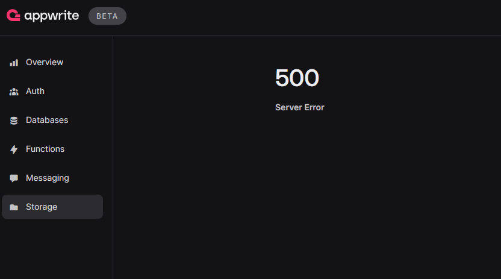
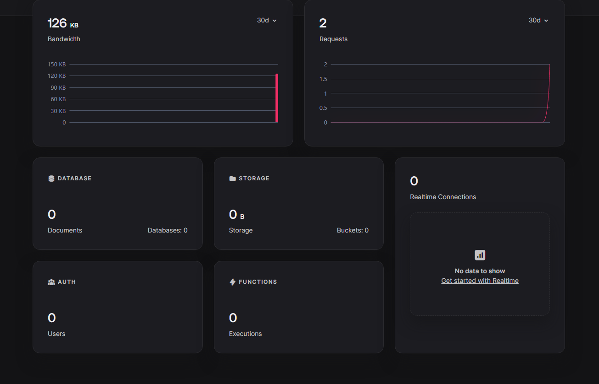
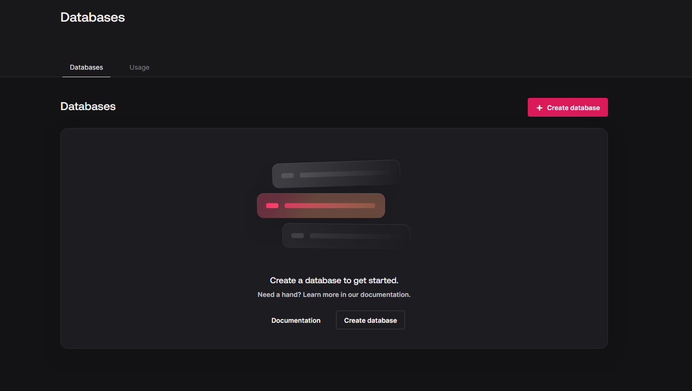

# Dropped tables

- **Incident Start:** 2024-11-14 16:59 UTC
- **Incident End:** 2024-11-15 01:40 UTC
- **Report Prepared By:** Steven Nguyen

## Summary

On November 14th, we received reports about storage not working after a recent deployment. We quickly reverted, but then received reports about data missing in projects.

After some investigation, we determined the some tables were dropped in one of our databases, but verified we were not affected by any sort of attack or SQL injection.

To get back online, we took the database down to prevent inconsistencies with new data and then restored using backup and replaying bin logs to ensure we have all the data. During this time, users on the other database clusters remained unaffected. In addition, new project creations were routed to a fallback database cluster thereby preventing any disruption to new users and projects.

## Incident details

### Initial detection

We first detected the problem on 2024-11-14 at 16:59 UTC when a [community member raised](https://discord.com/channels/564160730845151244/1102936099745177700/1306664703895797770) an issue with accessing a storage page in the Appwrite Console.

After we reverted our deployment, storage started to work, but [another user reported](https://discord.com/channels/564160730845151244/1102936099745177700/1306668753630531657) data was missing.

### Affected components

Initially, only the bucket page in the Appwrite Console was affected for projects on a single database.

The missing data problem affected auth, databases, functions, messaging, and storage for projects on the same database.

### User impact

The storage issue only impacted developers trying to access a bucket in the Appwrite Console.

The missing data had a wider impact as data all the data for the affected projects were missing.

## Root cause analysis

### Preliminary findings

The storage issue was likely caused by some failed API call on the bucket page.

After we reverted and users reported missing data, we dug into the database tables to verify data was missing. Looking at the bin log, we were able to confirm tables were dropped.

### Root cause

It seems like a [recent upgrade to utopia-php/database](https://github.com/appwrite/appwrite/pull/8797) included a lot of changes in how we handle duplicate collections and introduced a bug that dropped the tables.

## Resolution and recovery

### Immediate Actions

We quickly rolled back to prevent further damage.

In addition, we removed the database to prevent inconsistencies with new data. This also had the added benefit that new projects were created in older databases preventing disruption for new users and projects.

### Resolution

To restore the data, we restored to a previous backup.

To ensure all the data was restored, we gathered the bin logs up to the point in which the tables were dropped and then replayed those against the restored backup.

## Lessons learned

### What went well

* The team quickly mobilized to restore services.
* Database backups worked as expected.
* Database clustering allowed us to recover the data to one of the replicas.
* Point in time recovery ensured there was no data loss.

### What can be improved

* Our monitoring didn't alert us of the problem. We only learned about it from the community. Since the data was deleted and no service actually went down ( 500 error ) the montiors were fooled into thinking everything was fine.

### Action items

1. Improve worker handling of jobs for offline databases.
2. Increase the frequency of point in time backups so there's less events that need to be replayed from the bin log.
3. Find ways to make restoration faster.
4. Fix the bug that caused tables to drop.
5. Ensure we have tests to prevent such scenario from happening. Prevent a practice where fallback behavior is to drop a table.

## Additional resources

### Related

* [Better Stack incident](https://status.appwrite.online/incident/461590?mp=true)
