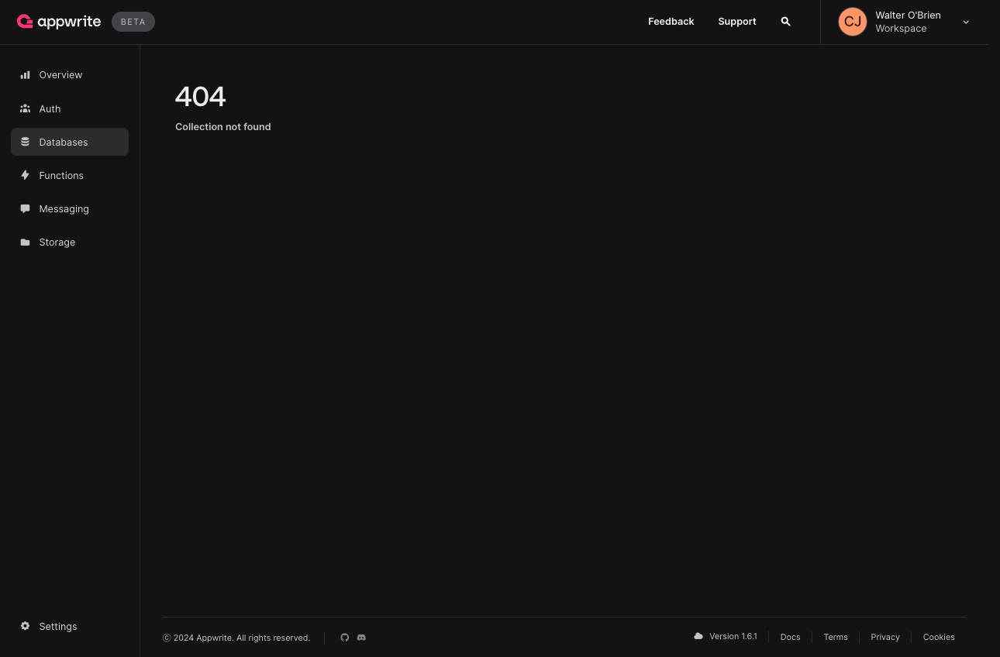

# Metadata table drop

- **Incident Start:** 2024-12-01 03:13:43 UTC
- **Incident End:** 2024-12-02 03:00:00 UTC
- **Report Prepared By:** Shmuel fogel

## Summary

On Sunday, December 1st, a team member noticed a complaint from a community member about the Cloud. Several users were reporting a 404 error on collections, which also affected his own cloud collections. Logging errors indicated a high error rate for "collection not found."

After some investigation, we determined that a metadata table had been dropped in one of our databases. We confirmed that there was no indication of an attack or SQL injection involved.

To get back online, we restored only that single table from the database snapshot taken on November 30, 2024, at 11:13:18 UTC. At this point, 99% of the projects on that particular database were up and running again.

We restored the gap of documents from the time of the incident on that table as well.

There was no data loss except for the data in this particular table.

## Incident details

### Initial detection

We first detected the problem on December 1, 2024, at 06:26 UTC, when we noticed that there were only 3,510 rows the table. This led us to realize that the table had either been truncated or dropped.

To investigate further, we searched the database binlogs for drop and truncated transaction and saw we had a DROP TABLE incident.

### Affected components

The missing data issue affected authentication, databases, functions, messaging, and storage for projects on that particular database. In some cases, where the table cache was used, the service would still function normally.

### User impact

The missing data had a wide impact on all services using the database, as all service collections uses this main table.

## Root cause analysis

In our database library, we had a DuplicateException thrown which caused the drop table.

[Database library statement](https://github.com/utopia-php/database/pull/489/files#diff-14149d1580fa54670629e57c6d684530e50ab17fb75d888418906c30b1595225L220)

### Preliminary findings

The Database library dropped left over table creation in case of failure.

### Investigation

After verifying in the binlogs that only one table was dropped, and knowing that there is only one place in the library where DROP TABLE IF EXISTS is used, we identified the source of the issue. We created a PR to remove this code to ensure it will not be triggered again.

https://github.com/utopia-php/database/pull/489

### Root cause

An error triggered during a project creation lead to deletion of the table due to the drop statement in database library. As the metadata table is used for multiple collections, entire projects were affected.

## Resolution and recovery

### Immediate Actions

### Resolution

We recovered the original table from a snapshot taken at 2024-11-30 11:13:18 UTC.

We generated the missing data gap, from the time of the backup to the time of the incident.

By 11:29 UTC, we had recovered 99% of the projects. Users were able to access their data without any issues, although some projects were still being fixed.

After we restored the gap in data, 99.9% of the projects were online and operational. By 15:53 UTC, all the missing database table had been restored.

At UTC on December 2 03:00 we fully resolved the incident.

## Lessons learned

### What went well

* The team quickly mobilized to restore services.
* Database backups worked as expected.
* Recovery strategy and speed of response.

### What can be improved

- Ability to easily check how widespread the issue is

### Related

* [Better Stack incident](https://status.appwrite.online/incident/470403)