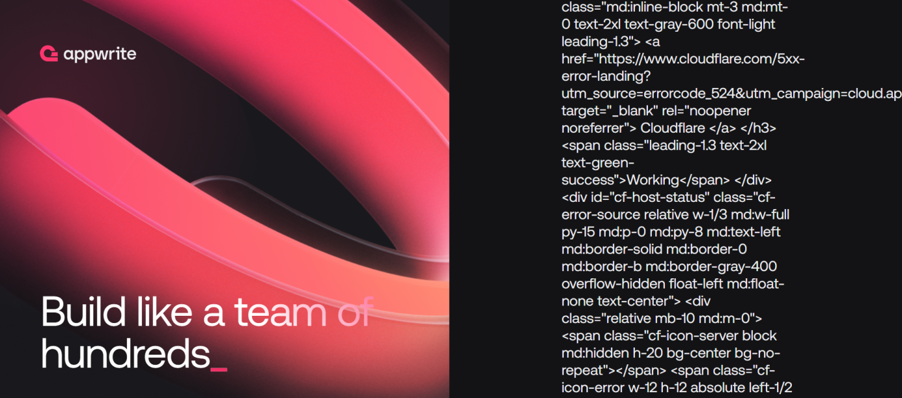

# Database issue

- **Incident Start:** 2025-06-03 23:28 UTC
- **Incident End:** 2025-06-04 00:18 UTC
- **Report Prepared By:** Steven Nguyen

## Summary

While Appwrite Cloud was working fine, we noticed an increase in memory usage on one of our databases. As a precautionary measure, we preemptively switched the primary database to prevent the slight chance of an incident.

After the switch, we started seeing an increase in timeout errors with requests going to the secondary database. Because of this, about 15-25% of requests timed out.

After fixing the failover, the API became responsive again.

## Incident details

### Initial detection

We first realized there was an issue when our alerts triggered right after switching the primary database.

### Affected components

Some requests that required the particular database experienced errors. Requests for cached data were unaffected.

### User impact

Some end users received 524 errors as requests to Appwrite timed out. For example:

## Root cause analysis

### Preliminary findings

Because database queries were routed to the wrong host, the requests timed out.

### Investigation

Error logs indicated queries were going to the wrong database hosts and timing out.

### Root cause

Since the database hosts were incorrect, queries timed out.

## Resolution and recovery

### Immediate Actions

The first attempt to mitigate the problem was to move the secondary database so that queries would be sent to the primary database.

However, requests were still being routed to the secondary database and errors were still occuring.

### Resolution

Finally, to solve the problem, we re-routed requests so that requests would go to the primary database.

## Lessons learned

### What went well

1. We detected the incident and immediately started troubleshooting

### What can be improved

1. Quicker creation of Better Stack incident to keep users informed
1. Better instructions/documentation on changing the primary database node

### Action items

1. Improve documentation in changing the primary database
1. Improve automation in changing the primary database
1. Review all our database configs for correctness and consistency

## Additional resources

1. [Better Stack incident](https://status.appwrite.online/incident/597093?mp=true)
